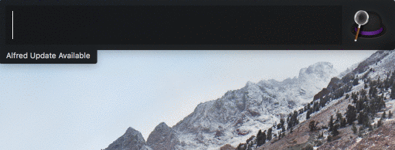
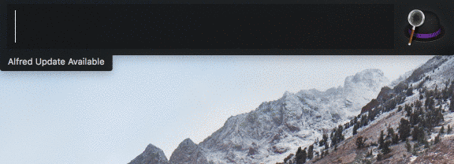

# Currency exchange workflow for [Alfred 3](https://www.alfredapp.com)
This workflow allows you to easily convert a currency with live currency rate. They keyword is `cur`, which is the abbreviation for "Currency". An example of use: ```cur usd 100```

## Installation

Go to [here](https://github.com/IJaykkk/alfred-currency-converter-workflow/releases), download and extract the workflow. Move the workflow into the Alfred 3.

## Commands

1. To Convert a Currency
```
cur [currency] [amount]
```

To convert the currency into other currencies, which are your commonly used ones.

-


2. To Add a Currency
```
cur add [currency]
```

To add a currency as your commonly used one, which will show up in the search results whenever you try to convert other currency. The max number of commonly used currencies is 6. If you keep adding currencies, the oldest currency you added will be popped out from the list.

If you forget how to spell the abbreviation of a currency, don't worry. Just enter whatever you can recall, the workflow will help you find the similar currencies by promting suggestions.

-


3. To Delete a Currency
```
cur del
```

To delete a currency from your list of commonly used currencies.

-
